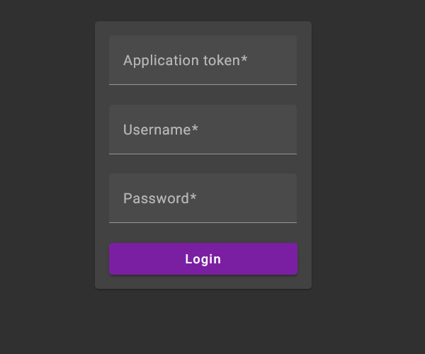
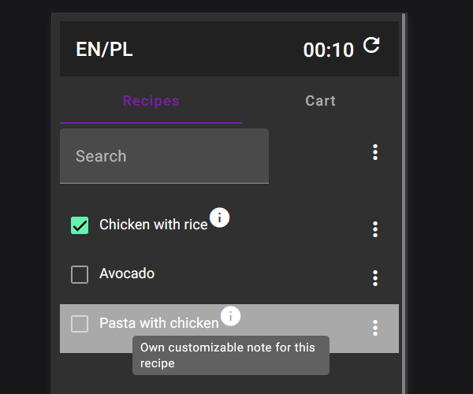
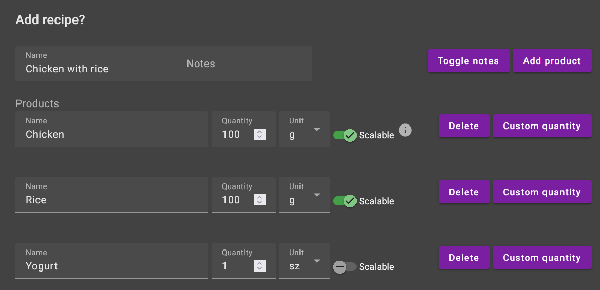
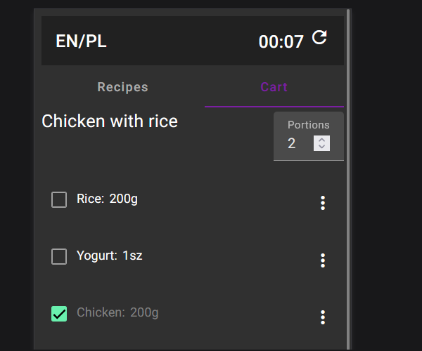

# recipes-manager

## Busines

Create your own recipes and share them with your roommates. Go shopping together and check products off your list!

### Login

Login with usernamen and password, and token provided by administrator.

### List of recipes

You can select the recipe you currently need on the list.

Add a new recipe with a list of products needed for it

### Cart

When a recipe is selected on the cart tab, a shopping list will appear

## Technical

### Frontend

[Angular 17](https://angular.io/) with [Angular materials 17](https://material.angular.io/)  

### Backend

MongoDB provided by [AtlasDB](https://www.mongodb.com/atlas/database) with REST API integration.

# Demo

Application hosted on githubpage. Credentials to login: any set of characters.  

[Demo](https://dominik93.github.io/recipes-manager/demo/browser/) 